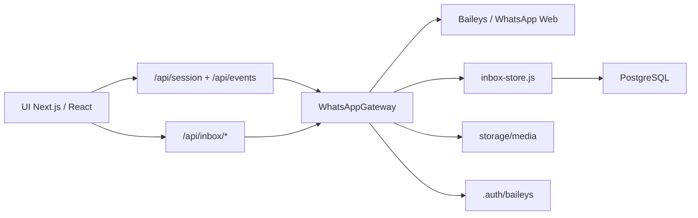

# Documentacao principal | Zap2 WhatsApp Web Template

## 1. Objetivo

Zap2 foi desenhado como um template funcional de WhatsApp Web para ser acoplado a outros sistemas.

O alvo principal e:

- CRM com modulo de atendimento
- Sistema comercial com inbox de clientes
- Software interno que precise de uma pagina de WhatsApp
- Produto SaaS que queira adicionar um canal de conversa

O template resolve quatro blocos ao mesmo tempo:

1. Conexao com WhatsApp via Baileys
2. Persistencia operacional em PostgreSQL
3. Interface estilo WhatsApp Web
4. API de integracao reutilizavel

## 1.1 Leitura orientada para IA

Se este repositorio estiver sendo lido por uma IA de programacao, a regra inicial e simples:

nao assuma que o sistema host pode receber este template sem analise previa.

Antes de qualquer implementacao, a IA deve:

1. analisar a stack do projeto host
2. identificar o backend real
3. identificar o banco de dados real
4. verificar se o sistema ja tem autenticacao, autorizacao e ownership
5. decidir entre integracao interna e modulo externo

Se o projeto host for novo, a IA pode usar o fluxo completo do template.

Se o projeto host ja existir, a IA deve primeiro entender a arquitetura em vez de sair copiando tabelas, rotas e componentes.

Depois da analise tecnica, a IA deve confirmar com o usuario a estrategia de integracao. O ponto principal aqui e simples: em sistema existente, o modo recomendado e manter Zap2 em uma pasta/modulo dedicado, subir os containers do modulo e criar uma nova pagina `Chat` ou `WhatsApp` no menu lateral do produto host.

Leitura complementar: [Modos de integracao](./modos-de-integracao.md)

## 2. Stack real utilizada

### Frontend

- Next.js 16 App Router
- React 19
- CSS global customizado

### Backend

- Next.js Route Handlers rodando em runtime Node.js
- Baileys 6.17.16 para conexao com WhatsApp Web
- Pino para logging
- QRCode para geracao do QR

### Persistencia e arquivos

- PostgreSQL 16
- `pg` para acesso ao banco
- armazenamento local em `storage/media`
- credenciais Baileys em `.auth/baileys`

### Audio e midia

- FFmpeg para transcodificacao de audio
- Jimp listado como dependencia externa do bundle

## 3. Visao arquitetural

## 4. Estrutura logica do codigo

### Interface

- `src/components/whatsapp-dashboard.js`
  - decide entre tela de pareamento e inbox
- `src/components/whatsapp-pairing.js`
  - tela de QR Code
- `src/components/whatsapp-inbox.js`
  - lista de conversas, thread, gravador, drawer, labels e detalhes

### Core de WhatsApp

- `src/whatsapp-gateway.js`
  - orquestra conexao, eventos, envio, sincronizacao e persistencia
- `src/whatsapp-singleton.js`
  - sobe uma unica instancia do gateway

### Persistencia e adaptadores

- `src/lib/database.js`
  - schema e acesso PostgreSQL
- `src/lib/inbox-store.js`
  - queries, upserts, leitura de chats, mensagens, labels e detalhes
- `src/lib/whatsapp-helpers.js`
  - normalizacao de JID, leitura de payloads, titulos e tipos
- `src/lib/media-storage.js`
  - grava arquivos e monta caminhos
- `src/lib/audio-transcoder.js`
  - converte audio para voice note

### API HTTP

- `src/app/api/session/route.js`
- `src/app/api/events/route.js`
- `src/app/api/inbox/events/route.js`
- `src/app/api/inbox/chats/route.js`
- `src/app/api/inbox/chats/[chatJid]/details/route.js`
- `src/app/api/inbox/chats/[chatJid]/messages/route.js`
- `src/app/api/inbox/chats/[chatJid]/labels/route.js`
- `src/app/api/inbox/send/route.js`
- `src/app/api/media/[mediaId]/route.js`
- `src/app/api/health/route.js`

## 5. O que foi personalizado em cima da base

Este projeto deve ser entendido como uma implementacao personalizada em cima da base Baileys, e nao como um exemplo minimo.

Principais personalizacoes:

- persistencia completa de sessao, chats, mensagens, contatos e midia
- ressincronizacao de app state para labels
- labels hibridas: WhatsApp + internas do sistema
- enriquecimento de identidade de contato e participante de grupo
- envio de audio com conversao para formato de voice note
- drawer de detalhes da conversa
- eventos em tempo real para sessao e inbox
- layout orientado a uso real em CRM

## 6. Limites atuais do template

Esses limites precisam estar documentados para quem vai integrar:

1. O projeto esta estruturado para uma sessao principal por padrao (`primary`)
2. O banco atual e PostgreSQL-oriented, com uso real de `jsonb`, `timestamptz`, `ON CONFLICT` e operadores especificos
3. Nao existe camada de autenticacao do produto hospedeiro dentro deste template
4. Nao existe segregacao multi-tenant pronta
5. O armazenamento de midia e local por padrao

Esses pontos nao invalidam o template. Eles apenas definem o que deve ser adaptado para producao em sistemas maiores.

## 7. Estrategias de adocao

### Estrategia A | Projeto novo

Use o template como modulo base do produto.

Quando preferir:

- sistema novo
- equipe ja trabalha com Node.js / Next.js
- desejo de acelerar entrega
- PostgreSQL disponivel

Leitura: [Projeto novo](./projeto-novo.md)

### Estrategia B | Projeto existente em Next.js / Node.js

Integre o modulo sem espalhar arquivos. O formato preferido e criar uma pasta/aplicacao propria para o contexto WhatsApp dentro do workspace do sistema host, mantendo boundaries claros de pasta, servicos e banco.

Quando preferir:

- sistema host ja usa Node.js
- o time quer uma unica aplicacao
- o banco host e PostgreSQL ou pode receber as tabelas

Leitura: [Projeto existente](./projeto-existente.md)

### Estrategia C | Projeto existente em PHP, Java, .NET ou stack nao-Node

Nao tente portar o gateway Baileys diretamente para o backend host. O movimento tecnicamente correto e operar este template como servico especializado de WhatsApp e integrar por HTTP, SSE, SSO e iframe/pagina embutida.

Quando preferir:

- backend host nao e Node.js
- o produto ja esta maduro
- o time quer reduzir risco de invasao arquitetural

Leitura: [Projeto existente](./projeto-existente.md)

## 8. Decisao tecnica recomendada para sistemas heterogeneos

Se o sistema hospedeiro for PHP ou Java, a recomendacao arquitetural e clara:

1. manter o modulo WhatsApp como servico Node.js isolado
2. expor a UI por rota dedicada ou subdominio interno
3. integrar autenticacao e permissao pelo produto host
4. compartilhar apenas o necessario com o sistema principal

Motivo:

- Baileys e Node-first
- a camada atual depende de runtime Node, arquivos locais e SSE
- tentar reescrever isso dentro de PHP/Java aumenta custo e risco

## 9. Documentos complementares

- [Projeto novo](./projeto-novo.md)
- [Projeto existente](./projeto-existente.md)
- [Modos de integracao](./modos-de-integracao.md)
- [Banco de dados](./banco-de-dados.md)
- [API e eventos](./api-e-eventos.md)
- [Guia para IA](./guia-para-ia.md)

## 10. Credito e autoria

Template concebido e desenvolvido por Paulo Henrique.

A base tecnica foi continuamente adaptada para maximizar usabilidade operacional, previsibilidade de integracao e proximidade visual com o WhatsApp Web real.
